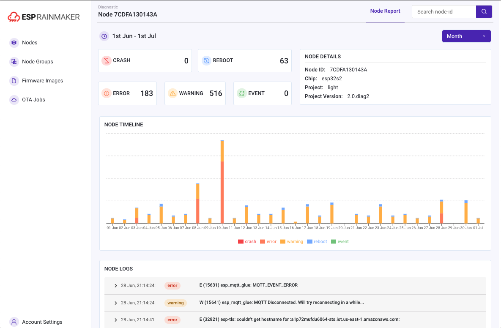
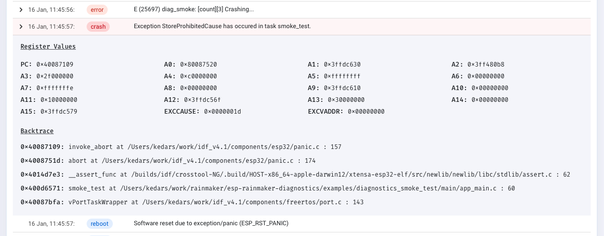
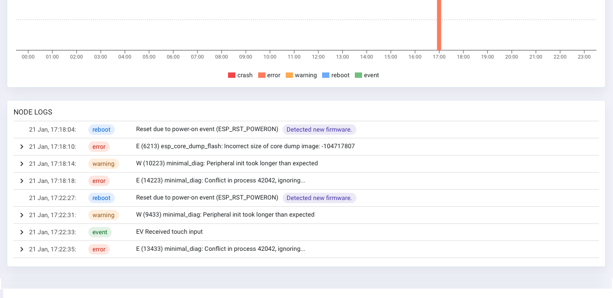
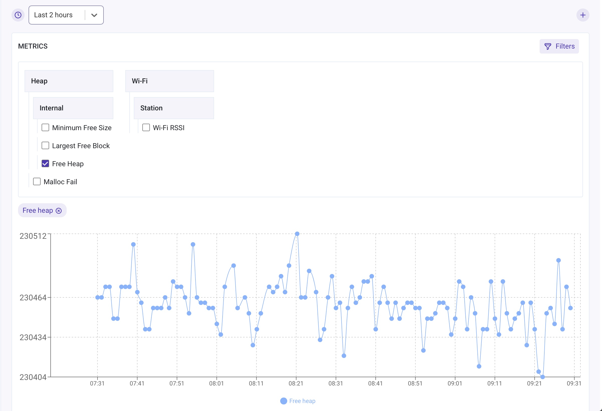
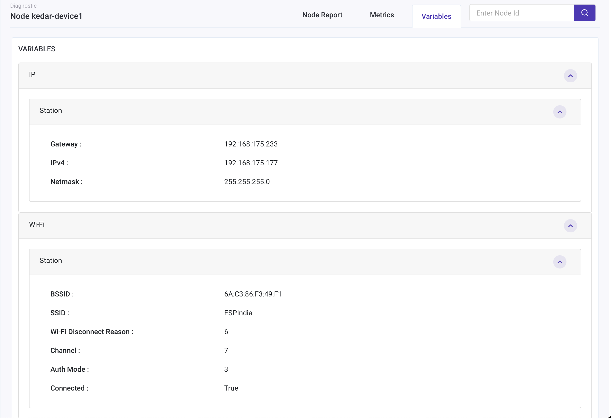

# ESP Insights (Beta)

ESP Insights is a remote diagnostics solution that allows users to remotely monitor the health of ESP devices in the field.

## Introduction

Developers normally prefer debugging issues by physically probing them using gdb or observing the logs. This surely helps debug issues, but there are often cases wherein issues are seen only in specific environments under specific conditions. Even things like casings and placement of the product can affect the behaviour. A few examples are

- Wi-Fi disconnections for a smart switch concealed in a wall.
- Smart speakers crashing during some specific usage pattern.
- Appliance frequently rebooting due to power supply issues.

Having remote diagnostics facility helps in identifying such issues faster. ESP Insights includes a firmware agent (the Insights agent) that captures some of the vital pieces of diagnostics information from the device during runtime, and periodically uploads them to the ESP Insights cloud. The cloud then processes this data for easy visualisation. Developers can login to a web based dashboard to look at the health and issues reported by their devices in the field. A sample screen is show here.



Currently, developers can monitor the following information from the web based dashboard:

- Error logs: Anything that is logged on console with calls with ESP_LOGE by any component in the firmware
- Warning logs: Anything that is logged on console with calls with ESP_LOGW by any component in the firmware
- Custom Events: Application specific custom events that the firmware wishes to track via calls to ESP_DIAG_EVENT
- Reset reason: The reason why the device was reset (power on, watchdog, brownout, etc.)
- Coredump summary: In case of a crash, the register contents as well as the stack backtrace of the offending thread (wherever possible)
- Metrics: Time-varying data like the free heap size, the Wi-Fi signal strength that is plotted over a period of time
- Variables: Variable values like the IP Address or state variables that report their current value

All of this information should help the developer understand better how their device is performing in the field. You may find more details about all of these in the [Features](#features) section below.

> ESP Insights currently works with the ESP RainMaker cloud. Support for other cloud services will be available in a subsequent release.

## Getting Started

> If you have already been using ESP RainMaker, you can directly try [this example from ESP RainMaker](https://github.com/espressif/esp-rainmaker/tree/master/examples/switch_with_insights).

In order to enable diagnostics reporting in your firmware, you need to follow a few basic steps summarised below:

- Set up ESP IDF and ESP Insights.
- Build and Flash the `minimal_diagnostics` example on your board.
- Use ESP RainMaker [Host driven claiming](https://rainmaker.espressif.com/docs/claiming.html#host-driven-claiming-esp32) to get the cloud credentials.
- Visit the ESP Insights Dashboard, upload your firmware package and check the diagnostics information.

Head over [here](examples/README.md) for more information.

## Features
Let's look at some of the features of ESP Insights

### Core Dump
In case of a firmware crash, the Insights agent captures the core dump information into the flash memory and reports it to the ESP Insights cloud in the subsequent boot-up. This allows you to look at all the crash logs that the devices may be generating in the field.

The entire stack backtrace leading up to the crash is also captured and reported. In order to optimise the device-cloud communication, the firmware only sends a summary of the core dump. The summary contains most useful contents of the core dump like the program counter, the exception cause, exception vaddress, general purpose registers, and the backtrace.



#### Configurations
The core dump reporting requires some configuration options to be set. The configuration options in the below sdkconfig.defaults file can be added in your own application's SDK configuration using the following command:
```
cat <<EOF>> sdkconfig.defaults
CONFIG_ESP32_ENABLE_COREDUMP=y
CONFIG_ESP32_ENABLE_COREDUMP_TO_FLASH=y
CONFIG_ESP32_COREDUMP_DATA_FORMAT_ELF=y
CONFIG_ESP32_COREDUMP_CHECKSUM_CRC32=y
CONFIG_ESP32_CORE_DUMP_MAX_TASKS_NUM=64
EOF
```

Reconfigure the project using the following
```
rm sdkconfig
idf.py reconfigure
```

#### Partition Table
In order to store the core dump into flash an additional coredump partition is required. Add the following line to your project's partitions.csv.
```
coredump, data, coredump, , 64K
```

### Logs
The `esp_log` is the default logging component in `esp-idf`. Typically `ESP_LOGE` and `ESP_LOGW` are used to log errors and warnings in the firmware. All the logs logged using the esp_log component are tracked by the Insights agent and reported to the ESP Insights cloud.
This allows you to view these errors through the ESP Insights Dashboard, providing you with detailed information about what may be going on.



*NOTE*: If you have multiple devices in the field, capturing every error and warning may generate large volumes of data that gets reported to the cloud. We allow you mechanisms to fine-tune what of these logs can be reported to the Insights cloud.

#### Configure the log level
Users can configure the log level to report by using `esp_diag_log_hook_enable()` and `esp_diag_log_hook_disable()` APIs.
```
/* enable tracking error logs */
esp_diag_log_hook_enable(ESP_DIAG_LOG_TYPE_ERROR);

/* enable tracking all log levels */
esp_diag_log_hook_enable(ESP_DIAG_LOG_TYPE_ERROR | ESP_DIAG_LOG_TYPE_WARNING | ESP_DIAG_LOG_TYPE_EVENT);

/* disable tracking custom events */
esp_diag_log_hook_disable(ESP_DIAG_LOG_TYPE_EVENT);
```

#### Maintaining Logs Across Reboots
Often it happens that a crash is preceded by certain error conditions that trigger the crash. It would be invaluable if we could extract these errors that occurred just before a crash happened, to understand the particulars of the crash. ESP Insights provides a way to capture this.

Most ESP32 SoCs are equipped with an RTC memory that is retained across a soft power cycle event. The Insights agent uses this memory to store the critical errors that occurred on the system. On any boot-up, the Insights agent will check for any unreported errors from the previous boot-up through this RTC memory and report that to the Insights cloud.

### Reboot Reason
The Insights agent reports the reboot reason on every boot-up to the cloud. This allows you to identify whether a device rebooted because of a crash, a watchdog trigger, a soft reset, or a power-reset by the end-user.

### Metrics
The Insights agent supports recording and reporting metrics to cloud. You may then view  graphs, through the Insights dashboard, that plot how these metrics changed over a period of time.

You should enable `CONFIG_DIAG_ENABLE_METRICS=y` config option to enable metrics support.

The Insights agent can record a set of pre-defined system metrics. Additionally, you could also add your own custom metrics.




#### Heap Metrics
The Insights agent has implemented heap metrics collection and reports free memory, largest free block, and minimum free memory ever. These parameters are tracked and reported for heap in the internal RAM as well as for the heap in the external RAM (in case device has the PSRAM). It also records failed memory allocations. Note that recording failed allocation is available from esp-idf release/v4.2 and onwards.

Enable `CONFIG_DIAG_ENABLE_HEAP_METRICS=y` config option to enable heap metrics.

#### Wi-Fi Metrics
The Insights agent has also implemented Wi-Fi collecting Wi-Fi signal strength (RSSI) information. The RSSI is collected and recorded only when the RSSI value drops below a pre-configured threshold. The threshold can be configured using [esp_wifi_set_rssi_threshold()](https://docs.espressif.com/projects/esp-idf/en/latest/esp32/api-reference/network/esp_wifi.html?highlight=esp_wifi#_CPPv427esp_wifi_set_rssi_threshold7int32_t) API. Note that threshold based RSSI reporting is supported from esp-idf v4.3 and onwards.

There is also an API to collect and report wifi metrics at any given point in time.
```
/* Reports RSSI to cloud and also prints to console */
esp_diag_wifi_metrics_dump();
```

#### Custom Metrics
It is fairly simple to register your own metrics as well. This can be done as: 

```
/* Register a metrics to track room temperature */
esp_diag_metrics_register("temp", "temp1", "Room temperature", "room", ESP_DIAG_DATA_TYPE_UINT);

/* Record a data point for room temperature */
uint32_t room_temp = get_room_temperature();
esp_diag_metrics_add_uint("temp1", &room_temp);
```

As you may notice, every metric has some metadata associated with it. Some explanation of these fields:
- "temp" - Tag for the metrics, group of metrics can be enabled/disable based on the tag
- "temp1" - A unique key identifying the metric
- "Room temperature" - The label that should be shown on the Insights dashboard
- "room" - Hierarchical path in order to group metrics to allow easy navigation
- ESP_DIAG_DATA_TYPE_UINT - Data type

### Variables
Diagnostics variables are similar to metrics but they represent entities where their _current_ value is much more important than over a period of time. For example, the IP address of the device.

You should enable `CONFIG_DIAG_ENABLE_VARIABLES=y` config option to enable variables support in firmware.

The Insights agent can record a set of pre-defined system variables. Additionally, you could also add your own custom variables.



#### Network Variables
The Insights module currently records some of the following network variables.

* For Wi-Fi: connection status, SSID, BSSID, Channel, Authentication mode, and wifi disconnection reason
* For IP: IP address, gateway, and netmask parameters

You should enable `CONFIG_DIAG_ENABLE_NETWORK_VARIABLES` config option to enable network variables.


#### Custom Variables
It is fairly simple to register your own variables as well. This can be done as:

```
/* Register a variable to track stations associated with ESP32 AP */
esp_diag_variable_register("wifi", "sta_cnt", "STAs associated", "wifi.sta", ESP_DIAG_DATA_TYPE_UINT);

/* Assuming WIFI_EVENT_AP_STACONNECTED and WIFI_EVENT_AP_STADISCONNECTED events track the number of associated stations */
esp_diag_variable_add_uint("sta_cnt", &sta_cnt);
```

As you may notice, every variable has some metadata associated with it. Some explanation of these fields:
- "wifi" - Tag for the variables, group of variables can be enabled/disabled based on the tag
- "sta_cnt" - A unique key identifying the variable
- "STAs associated" - The label that should be shown on the Insights dashboard
- "wifi.sta" - Hierarchical path in order to group variables to allow easy navigation
- ESP_DIAG_DATA_TYPE_UINT - Data type

### Transport Sharing
The Insights agent uses MQTT (TLS) sessions to send data to the cloud. Creating a separate TLS session on the device could add to the memory consumption on the device. 
To avoid this, the Insights agent shares the transport (MQTT) with your cloud agent. Currently the RainMaker cloud agent is supported. This ensures that we reuse the socket/TLS connection without adding a connection memory overhead on your device.

### Optimising Device-Cloud Communication
The diagnostics data transfer between the device and the cloud is optimised to send as little data as possible. Some of the things that we do to ensure this are:
* We use CBOR based encoding, which provides a tight binary representation of data to be transported between the device and the cloud
* Wherever possible, we leverage the fact that the cloud can reference the ELF file for the firmware that is executing on the device. For example, if the firmware logs a read-only string data in diagnostics, this read-only string would already be present in the `rodata` of the firmware ELF image. So instead of transmitting the entire string, we just transmit the address of the string to the Insights cloud. The Insights cloud takes care of cross-referencing this with the appropriate ELF file to extract the string that is available.
* Many cloud platforms charge based on the MQTT messages. One of the features we are working on is to piggyback diagnostics data into the same MQTT message as the command-and-control data from your cloud service. This will bring further costs savings by optimising the number of distinct MQTT messages being exchanged with the cloud.

